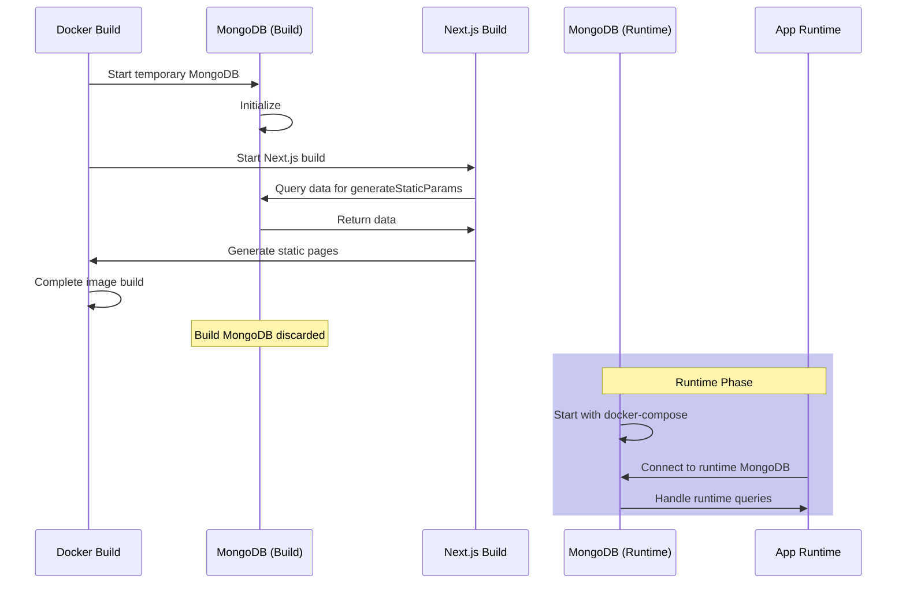

# Next.js Payload CMS Docker Deployment Guide

This repository contains two different approaches for deploying a Next.js application with Payload CMS and MongoDB using Docker. The main challenge these approaches solve is handling database connectivity during both build time and runtime, especially when dealing with Next.js's `generateStaticParams`.

## The Challenge

When using Next.js with `generateStaticParams`, we face a specific challenge: the build process needs to connect to MongoDB to generate static pages. This creates complications in a Docker environment because:

1. `generateStaticParams` runs during build time, not runtime
2. Docker Compose services aren't typically available during image building
3. Even with `depends_on` and `healthcheck`, the MongoDB service might not be fully ready when needed

```javascript
// Example of why we need database access during build
export async function generateStaticParams() {
  const payload = await getPayload({ config: configPromise })
  const posts = await payload.find({
    collection: 'posts',
    draft: false,
    limit: 1000,
    overrideAccess: false,
    select: {
      slug: true,
    },
  })

  const params = posts.docs.map(({ slug }) => {
    return { slug }
  })

  return params
}
```

## Approach 1: Multi-Step Docker Compose

### Setup

This approach uses the default `Dockerfile` and requires running Docker Compose commands in a specific order.

```bash
# Step 1: Start MongoDB first
docker compose up mongodb

# Step 2: Build the Next.js application
docker compose build payload

# Step 3: Start the application
docker compose up payload
```

### How it Works

1. MongoDB container starts first and becomes fully operational
2. During build, the application connects to MongoDB using `host.docker.internal`
3. After build, the application connects to MongoDB using the Docker network

### Configuration

```yaml
services:
  payload:
    build:
      args:
        # Use host.docker.internal for build time
        - DATABASE_URI=mongodb://host.docker.internal:27017/your_database_name
    environment:
      # Use Docker network name for runtime
      - DATABASE_URI=mongodb://mongodb:27017/your_database_name
```

### Why `host.docker.internal`?

- During build time, Docker services aren't networked together
- `host.docker.internal` provides a way to access host machine services
- This allows the build process to connect to MongoDB running on the host's network

### Limitations of `depends_on` and `healthcheck`

```yaml
depends_on:
  mongodb:
    condition: service_healthy
healthcheck:
  test: echo 'db.runCommand("ping").ok' | mongosh localhost:27017/test --quiet
```

While these configurations ensure MongoDB container is running, they don't guarantee:

1. The database is ready to accept connections
2. All database initialization is complete
3. The service is available during build time

## Approach 2: Self-Contained MongoDB Build

This approach uses `Dockerfile.with-mongodb` which includes MongoDB within the build process itself.

### How it Works

1. Uses MongoDB official image as base for build stage
2. Runs MongoDB internally during build process
3. Connects to external MongoDB during runtime

```dockerfile
# Build stage with MongoDB
FROM mongo:latest AS builder
# Add Node.js to MongoDB image
RUN apt-get update && apt-get install -y curl
RUN curl -fsSL https://deb.nodesource.com/setup_20.x | bash -
RUN apt-get install -y nodejs

# Start MongoDB in background during build
RUN mongod --fork --logpath /var/log/mongodb.log --bind_ip 127.0.0.1
```



### Advantages

1. Self-contained build process
2. No dependency on external services during build
3. More reliable and reproducible builds
4. Works in any CI/CD environment

### Disadvantages

1. Larger build image size
2. Longer build times
3. More complex Dockerfile

## Alternative Approaches

### Wait-For Script Approach (Not Recommended)

We initially tried using a wait-for script with MongoDB tools:

```bash
#!/bin/sh
until mongosh --host "$host" --eval "print(\"waited for connection\")"
do
  sleep 1
done
```

Issues encountered:

1. Installing `mongodb-tools` conflicts with pnpm dependencies
2. Added complexity to the build process
3. Still doesn't guarantee database readiness

### Deferred Static Generation

Next.js 13 introduced a powerful feature for handling static generation that can be particularly useful in scenarios where database connectivity during build time is challenging. This approach allows you to defer the generation of static pages until runtime, solving many of the issues we've discussed earlier.

#### Using `generateStaticParams` with an Empty Array

As per the [Next.js documentation](https://nextjs.org/docs/app/api-reference/functions/generate-static-params), you can return an empty array from `generateStaticParams` to statically render all paths the first time they're visited:

```javascript
// app/blog/[slug]/page.js
export async function generateStaticParams() {
  return []
}
```

This approach means that no paths will be rendered at build time, but they will be generated and cached on the first request.

#### Using `force-static`

Alternatively, you can use the `dynamic = 'force-static'` export to achieve a similar effect:

```javascript
// app/(frontend)/[slug]/page.js
export const dynamic = 'force-static'
```

Both of these methods allow you to bypass the need for database connectivity during the build process, as the static generation will occur at runtime when the database is guaranteed to be available.

#### Advantages of Deferred Static Generation

1. **Simplified Build Process**: No need to ensure database connectivity during build time.
2. **Faster Builds**: The build process doesn't need to wait for database queries to complete.
3. **Flexibility**: Pages are generated on-demand, allowing for easier updates and reducing the risk of stale content.

#### Considerations

1. **Initial Request Latency**: The first request to a page will be slower as it needs to be generated.
2. **Caching Strategy**: Ensure your caching strategy is optimized to make the most of this approach.

By incorporating these methods, you can significantly simplify your Docker deployment process and avoid many of the complexities associated with database connectivity during the build phase.

## Choosing an Approach

- Use **Approach 1** (Multi-Step) if:
  - You need simple deployment
  - You're comfortable with manual steps
  - You want smaller build images

- Use **Approach 2** (Self-Contained) if:
  - You need fully automated builds
  - You're setting up CI/CD pipelines
  - You want reproducible builds

- Use **Deferred Static Generation** if:
  - You want to simplify your build process
  - You're okay with slightly slower initial page loads
  - You're using Next.js 13 or later

## Common Issues and Solutions

1. **Database Connection Errors During Build**

   ```shell
   Error: MongoServerError: connect ECONNREFUSED
   ```

   - Cause: MongoDB not ready or not accessible
   - Solution: Ensure MongoDB is running before build, use self-contained approach, or consider deferred static generation

2. **Host Resolution Issues**

   ```shell
   getaddrinfo ENOTFOUND mongodb
   ```

   - Cause: Docker network not established during build
   - Solution: Use `host.docker.internal` for build time or opt for deferred static generation

3. **Build Hanging**

   ```shell
   > Building 0/1 modules
   ```

   - Cause: Next.js waiting for database connection
   - Solution: Ensure database is accessible, timeout properly, or use deferred static generation

## Contributing

Feel free to submit issues and enhancement requests!
